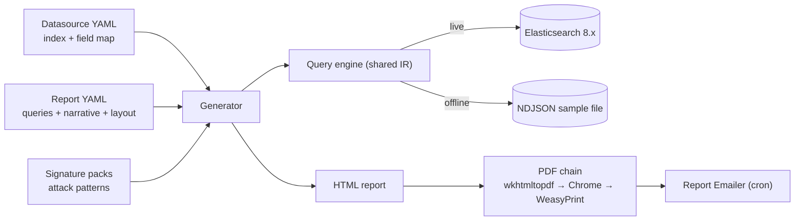

<p align="center">
  
</p>

<h1 align="center">TLSOC Reporting</h1>

<p align="center">
  <b>Declarative, template-driven executive reporting over ELK log data — daily HTML/PDF reports with KPIs, charts, attack-signature analysis, and plain-English insights.</b>
</p>

<p align="center">
  <a href="https://github.com/sankettaware16/tlsoc"></a>
  <a href="LICENSE"></a>
  
  
</p>

<p align="center">
  <a href="#getting-started">Getting Started</a> •
  <a href="docs/configuration.md">Configuration</a> •
  <a href="docs/automation.md">Automation</a> •
  <a href="docs/architecture.md">Architecture</a> •
  <a href="#tlsoc-ecosystem">Ecosystem</a>
</p>

---

## Overview

TLSOC Reporting is the reporting component of the
[TLSOC platform](https://github.com/sankettaware16/tlsoc). It turns parsed
security and infrastructure logs (nginx, Apache/Moodle, Postfix, Squid, …) into
daily **HTML + PDF** executive reports with KPIs, charts, attack-signature
analysis, plain-English insights, and prioritised action items.

**No report logic lives in Python.** A report is YAML (queries + narrative rules
+ layout), a log source is YAML (index + field map), and the engine multiplies
them:

```
one report definition  ×  every datasource with a matching profile
        web_daily      ×  { nginx, moodle, <your next web source> }
```

Adding a log source or a report type is a configuration change, not a code
change.

## Key Features

- **Declarative everything** — queries, thresholds, insights, actions, badges,
  and layout are YAML; the Python framework is never edited for a new report.
- **Logical field mapping** — reports say `client_ip` / `url_path`; each
  datasource maps those to its real index fields. One report renders for many
  differently-mapped indexes.
- **Graceful degradation** — a source missing a field loses only the dependent
  section, never the report.
- **Signature-based security analysis** — categorised, severity-rated threat
  patterns with per-estate benign allowlists; probe attribution, served-probe
  alerting, auth-surface and bot analysis.
- **Offline preview** — render any report from an NDJSON sample file with zero
  infrastructure; identical output to a live cluster run.
- **Robust PDF chain** — wkhtmltopdf → headless Chrome → WeasyPrint, first
  available wins; HTML always survives a PDF failure.
- **Honest numbers** — hour-aligned timezone-aware windows (gap-free hourly
  charts), trend arrows auto-suppressed on ingest gaps, client aborts (499)
  excluded from error rates, 404s triaged into probe / by-design /
  genuinely-broken.
- **Email delivery** — the bundled
  [Report Emailer](TLSOC_Report_Emailer/README.md) sends the day's PDF to a
  recipient list on a cron schedule.

## Architecture



Framework internals: [docs/architecture.md](docs/architecture.md). The
platform-wide picture:
[tlsoc — Architecture](https://github.com/sankettaware16/tlsoc/blob/main/docs/architecture.md).

## Getting Started

### Requirements

- Python 3.10+
- An Elasticsearch 8.x cluster with parsed, ECS-style logs — as produced by
  [foss-soc-engine](https://github.com/sankettaware16/foss-soc-engine)
- One PDF engine on the host: `wkhtmltopdf`, Google Chrome/Chromium, or
  `weasyprint` (optional — HTML output works without any)

### Option A — on a TLSOC stack host (zero configuration)

On a host running
[TLSOCDockerDeploy](https://github.com/sankettaware16/TLSOCDockerDeploy),
the Elasticsearch host, password, and CA certificate are **auto-detected from
the deployment itself**:

```bash
cd /opt
sudo git clone https://github.com/sankettaware16/tlsoc-reporting-framework.git
sudo chown -R $USER: tlsoc-reporting-framework
cd tlsoc-reporting-framework

python3 -m venv .venv
.venv/bin/pip install -r requirements.txt
sudo apt install -y wkhtmltopdf        # PDF engine (skip if already there)

.venv/bin/python -m framework validate
.venv/bin/python -m framework generate --report web_daily --datasource moodle
```

On startup you'll see a
`[settings] auto-detected TLSOC deployment in ...: host=..., password, ca_cert`
line confirming where the connection came from. Auto-detection looks in
`/opt/TLSOCDockerDeploy` by default — if your stack lives elsewhere, set
`tlsoc_deploy.dir` in `config/settings.yaml`.

### Option B — any other machine (manual configuration)

Point the framework at Elasticsearch yourself: connection and identity values in
`config/settings.yaml`, the password only ever in a git-ignored `.env`
(`TLSOC_ES_PASS=...`). Both steps are detailed in
[docs/configuration.md](docs/configuration.md#connection-settings).

### Sanity checks

```bash
python3 -m framework list       # datasources, reports, runnable pairs
python3 -m framework validate   # compile-check everything, no ES needed
```

## Usage

```bash
# one report
python3 -m framework generate --report web_daily --datasource nginx

# everything that can run (the cron entry point)
python3 -m framework generate-all

# useful flags
--window-hours 168                  # weekly instead of daily
--window-end 2026-07-10T00:00       # re-run a historical day
--param top_n=20                    # override any report param
--formats html                      # skip PDF
```

Reports land in `output/html/` and `output/pdf/` as
`<report>_<datasource>_<date>.{html,pdf}`.

### Offline preview (no Elasticsearch)

Develop templates and queries against a sample file — the same query engine runs
over the file, so output is identical to a live run:

```bash
python3 -m framework generate --report web_daily --datasource moodle \
        --backend local --sample log_samples/moodle_sample.json
```

Samples are **not shipped in the repository** — they are real log data; keep
them in the local, git-ignored `log_samples/` directory.

### Daily automation

`scripts/daily_reports.sh` loads `.env`, runs `generate-all`, and writes per-day
logs with automatic pruning — schedule it with cron and pair it with the
[Report Emailer](TLSOC_Report_Emailer/README.md) for delivery. Full guide,
including the failure-investigation table: [docs/automation.md](docs/automation.md).

## Repository Structure

```
├── framework/              # The engine (Python) — not edited for new reports
│   ├── cli.py              #   list / validate / generate / generate-all
│   ├── generate.py         #   orchestrator
│   ├── registry.py         #   loads the config/ tree
│   ├── queryspec.py        #   YAML query spec → shared filter IR
│   ├── backends/           #   es.py (live) and local.py (offline NDJSON)
│   ├── window.py           #   hour-aligned tz-aware reporting windows
│   ├── transforms.py       #   row post-processing
│   ├── rules.py            #   computed metrics / insights / actions / badges
│   ├── charts.py           #   inline-SVG charts (print-safe, no JS)
│   ├── render.py           #   sections → widgets → HTML
│   └── pdf.py              #   wkhtmltopdf → chrome → weasyprint fallback
├── config/                 # Everything you edit day-to-day
│   ├── settings.yaml       #   THIS deployment: ES endpoint, org, timezone
│   ├── datasources/        #   one YAML per log source: index + field map
│   ├── reports/            #   one YAML per report type: queries, narrative, layout
│   └── signatures/         #   shared attack-pattern packs
├── templates/framework/    # Page chrome + one partial per widget
├── scripts/                # Automation (cron wrapper with logging)
├── TLSOC_Report_Emailer/   # Daily PDF email delivery (cron)
├── log_samples/            # Local-only NDJSON samples (git-ignored)
├── output/{html,pdf}/      # Generated reports (git-ignored)
└── docs/                   # Documentation (see below)
```

## Documentation

| Document | Contents |
|---|---|
| [Configuration](docs/configuration.md) | Connection settings; adding datasources, queries, sections, report types, and detections |
| [Automation](docs/automation.md) | Daily cron runs, per-day logging, troubleshooting, email delivery |
| [Architecture](docs/architecture.md) | Framework internals: registry, query IR, backends, widgets, PDF chain |
| [Report Emailer](TLSOC_Report_Emailer/README.md) | Standalone daily PDF email sender |
| [Roadmap](docs/roadmap.md) | Planned reporting work |

## TLSOC Ecosystem

TLSOC Reporting is one component of TLSOC, the open-source Security Operations Platform:

| Repository | Purpose |
|---|---|
| [tlsoc](https://github.com/sankettaware16/tlsoc) | Ecosystem home — documentation, architecture, roadmap |
| [foss-soc-engine](https://github.com/sankettaware16/foss-soc-engine) | Log parsing and ECS normalization engine |
| [TLSOCDockerDeploy](https://github.com/sankettaware16/TLSOCDockerDeploy) | TLS-secured core stack (Kafka, Logstash, Elasticsearch, Kibana) |
| **tlsoc-reporting-framework** (this repository) | Declarative executive reporting (HTML/PDF) |

## Roadmap

Highlights — full list in [docs/roadmap.md](docs/roadmap.md):

- Additional report profiles beyond web access (mail flow, auth, vulnerability).
- Weekly/monthly rollup reports alongside the daily window.
- Shared signature-pack growth with community contributions.

## Contributing

New datasources, report types, signature packs, and framework improvements are
welcome — see [CONTRIBUTING.md](CONTRIBUTING.md). Please note our
[Code of Conduct](CODE_OF_CONDUCT.md).

## Security

- The Elasticsearch password comes **only** from the environment
  (`TLSOC_ES_PASS`, usually via the git-ignored `.env`). Nothing secret is
  committed.
- Generated reports (`output/`) and sample logs (`log_samples/`) are
  git-ignored: both contain real traffic data — internal IPs, hostnames, email
  addresses — and must never be committed.
- Report vulnerabilities privately per [SECURITY.md](SECURITY.md) — never via
  public issues.

## License

Free and open-source software under the [Apache License 2.0](LICENSE).

---

<p align="center">
  Built with ❤️ by <b>TrustLab, IIT Bombay</b><br/>
  Part of the <a href="https://github.com/sankettaware16/tlsoc">TLSOC Ecosystem</a>
</p>

<p align="center">
  <a href="https://github.com/sankettaware16/tlsoc">TLSOC</a> •
  <a href="https://github.com/sankettaware16/foss-soc-engine">Engine</a> •
  <a href="https://github.com/sankettaware16/TLSOCDockerDeploy">Deploy</a> •
  <a href="https://github.com/sankettaware16/tlsoc-reporting-framework">Reporting</a>
</p>
