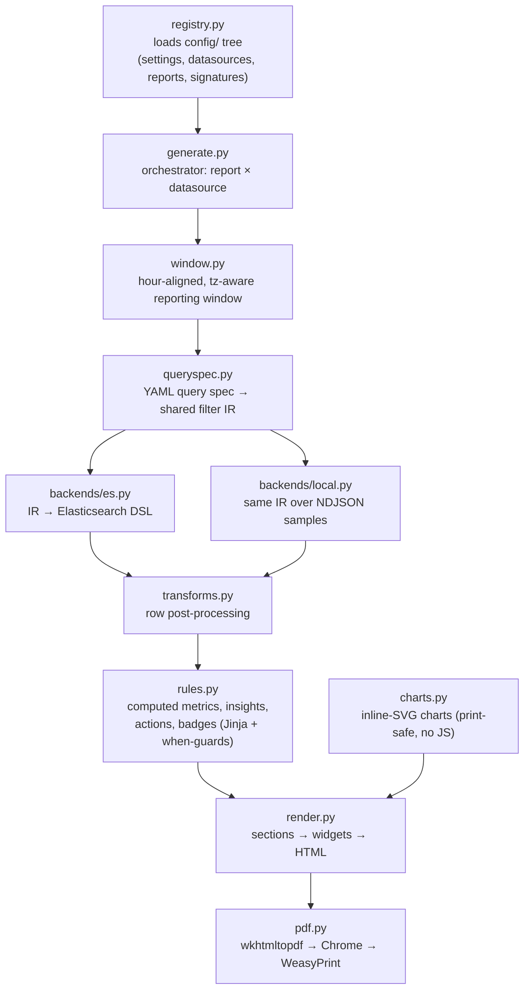

# Framework Architecture

How a YAML report definition and a YAML datasource become a rendered HTML/PDF
report. For the platform-wide picture, see
[tlsoc — Architecture](https://github.com/sankettaware16/tlsoc/blob/main/docs/architecture.md).

## Design principle

**No report logic lives in Python.** The framework (`framework/`) is a fixed
engine; reports, datasources, and signature packs (`config/`) are data. The
engine multiplies them:

```
one report definition  ×  every datasource with a matching profile
        web_daily      ×  { nginx, moodle, <your next web source> }
```

## Pipeline



Key properties of the design:

- **One query IR, two backends** — `backends/es.py` compiles the IR to
  Elasticsearch DSL; `backends/local.py` executes the *same* IR over a local
  NDJSON file. That is why offline preview output is identical to a live run.
- **Logical fields** — queries reference `client_ip` / `url_path`; the
  datasource's field map resolves them to real index fields at compile time. A
  missing mapping degrades only the dependent section (`skip_if_unmapped`).
- **Honest windows** — `window.py` produces hour-aligned, timezone-aware
  windows so hourly charts are gap-free; trend arrows are suppressed when the
  baseline window has ingest gaps.
- **Print-safe rendering** — charts are inline SVG with no JavaScript, so the
  PDF engines render them faithfully; `pdf.py` tries wkhtmltopdf, then headless
  Chrome, then WeasyPrint, and HTML output always survives a PDF failure.

## The config tree

| Directory | One file per | Contains |
|---|---|---|
| `config/datasources/` | log source | index pattern, logical-field map, per-estate params |
| `config/reports/` | report type | queries, computed metrics, insights/actions/badges, section layout |
| `config/signatures/` | signature pack | categorised, severity-rated attack patterns shared by all matching reports |

`config/settings.yaml` describes *this deployment*: Elasticsearch endpoint and
CA, organization identity printed on reports, and the rendering timezone.
Secrets are excluded — the ES password comes only from the environment
(`TLSOC_ES_PASS`).

## Report anatomy

A report YAML is three layers, all declarative:

1. **Queries** — named blocks (`count`, `terms`, `date_histogram`,
   `signature_categories`, …) with structured filters; `window: previous`
   re-runs any query over the preceding window for trend baselines.
2. **Narrative rules** — computed metrics, insights, actions, and badges as
   Jinja expressions with `when` guards; the entire narrative is editable in
   YAML.
3. **Sections** — widget layout (`kpi_row`, `timeseries`, `donut`, `bars`,
   `table`, `samples`, …) referencing queries by name, with `show_if` and
   `skip_if_unmapped` guards.

The full building-block reference is in
[configuration.md](configuration.md#add-a-query--section-to-an-existing-report).

## The Report Emailer

[`TLSOC_Report_Emailer/`](../TLSOC_Report_Emailer/README.md) is a deliberately
standalone tool (own config, state store, and logs): it watches for the day's
generated PDF and emails it to a recipient list once per day. Keeping it
separate means a rendering problem can never break delivery of yesterday's
report, and vice versa.
